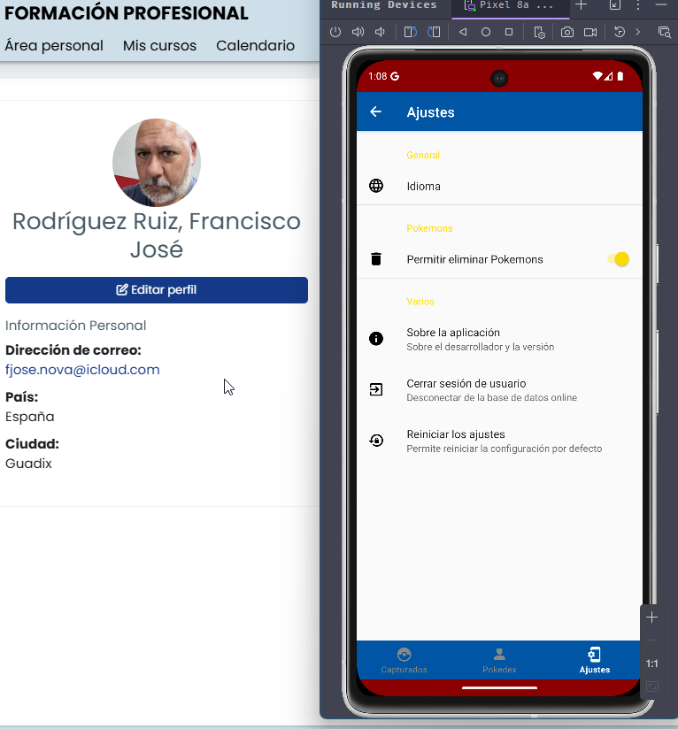

# README.md
## Tarea Unidad 3 PMDM - Pokedex
#### Autor: Francisco José Rodríguez Ruiz

### Índice de contenidos
- **Introducción**: Explica brevemente el propósito de la aplicación y qué hace. 
- **Características principales**: Describe las funcionalidades clave de la aplicación, como la autenticación, la Pokédex, la lista de Pokémon capturados y los ajustes. 
- **Tecnologías utilizadas**: Enumera las principales tecnologías y librerías empleadas en el proyecto (como Firebase, Retrofit, RecyclerView, etc.). 
- **Instrucciones de uso**: Proporciona pasos para clonar el repositorio e instalar cualquier dependencia necesaria para ejecutar la aplicación. 
- **Conclusiones del desarrollador**: Reflexiona sobre el proceso de desarrollo y cualquier desafío o aprendizaje obtenido durante el proyecto. 
- **Capturas de pantalla** (opcional): Si lo deseas, agrega imágenes que muestren la interfaz o funcionalidades de la app.
***
### Introducción
La app comienza mostrando una pantalla de logueo. Para ello hace uso de los servicios de Google Firebase Authentication. Una vez logueado el usuario, la app consume una API relacionada con el mundo Pokemon desde una ubicación web (https://pokeapi.co/api/v2), lo que se llama Pokédex. Cargará únicamente los 150 primeros Pokemons de la lista, mostrandolos en una de las opciones del menu ubicado en un BottomNavigation. 
Por otra parte, lleva a cabo la lectura (en el caso de que existan) de los Pokemons capturados asociados al usuario logueado (lo que significa que cada usuario tendrá los suyos). Se puede consultar desde otra de las opciones del BottomNavigation menú.
La tercera opción del menú consiste en una pantalla de ajustes en la que se podrán llevar a cabo algunas operaciones como:
- Cambio de idioma (inglés / español)
- Mostrar información sobre la app
- Usar un switch para determinar si el usuario puede o no borrar los Pokemons capturados
- Llevar a cabo el cierre de sesión, lo que provocará que se vuelva a solicitar el logueo del usuario
- Se ha añadido la opción de resetear y dejar por defecto la configuración de los ajustes

##### La app se desarrolla utilizando el IDE Android Studio con la siguiente estructura:
- IDE Android Studio
- JDK Versión 8
- Gradle Versión 8.10.2
  
***
### Características principales
Describe las funcionalidades clave de la aplicación, como la autenticación, la Pokédex, la lista de Pokémon capturados y los ajustes
Las principales funcionalidades de la app son estas:

1. **MyAplication**
   * Se trata de una clase personalizada que extiende de **Application**. Permite gestionar configuraciones globales y el ciclo de vida de la app. En mi caso la he usado para llevar a cabo la Inicialización de Firebase, asegurando de este modo que los servicios estarán disponibles desde el principio. Así mismo almacena y recupera el **UID** del usuario logueado, de forma que se facilite la gestión en la base de datos.
2. **Autenticación**
   * Inicialmente se verifica si ya existe un usuario autenticado (puede ser si al salir de la app anteriormente, no cerró la sesión). Se procede (si no hay nadie logueado) con la autenticación usando **Firebase Authentication UI**. Se han activado los métodos correo electrónico y Google. Se ha creado una sencilla interfaz de usuario para mostrar el inicio de sesión al usuario, permitiendole escoger su método.
   * Una vez el usuario ha llevado a cabo el intento de logueo, el resultado lógicamente puede ser de Éxito (se obtiene la **UID** del usuario y se redirige a 'MainActivity') o de Error (Mensaje de error y nos quedamos en la pantalla de logueo).
3. **Pokédex**
   * Se trata de una lista de 150 Pokemons almacenada en un ArrayList de un ViewModel (para que esté disponible en cualquier parte de la app) que se carga en el MainActivity en el momento de su creación (onCreate). El proceso se lleva a cabo en la función loadPokedexFromApi(). Esta es lanzada usando hilos, ya que debe finalizar antes de que se pueda ejecutar otra función que buscará los Pokemons capturados en la lista Pokedex para dejarlos marcados. Una vez cargada la ViewModel que gestiona y observa los datos del Pokédex, la gestión del recyclerView se lleva a cabo desde un fragment que permite mantener actualizada la información.
   * El usuario puede interactuar con la lista, tocando cada Pokemon para capturarlo. Esto provoca una actualización de de la lista de forma automática, marcando a true el atributo isCapturated de la lista Pokédex y cambiando la vista del pokemon capturado.
   * Finalmente hace otro consumo de la API para obtener todos los datos del Pokemon, que serán almacenados en la base de datos Firestore, asociandolos al usuario en curso.
4. **Pokemon capturados**
   * Iniciamos en la MainActivity la gestión de estos, justo en el momento en que procedemos (al igual que ocurría con la Pokedex) a leer los Pokemons capturados para este usuario (UID), pero en este caso los obtenemos leyendo la base de datos creada en Firestore.
   * Se cargan en un ArrayList gestionado por un ViewModel que facilita que la lista esté disponible en toda la app. En el caso de que el usuario aún no tenga Pokemons capturados, la lista permanecerá vacia.
   * Los Pokemons capturados se muestran desde otro fragment en una cardview que permite consultar de un vistazo sus datos.
   * A nivel de interacción con el usuario, se permiten dos acciones:
	   * Click sobre la tarjeta: carga un nuevo fragment (DetailPokemonFragment) en el cual se mostrarán todos los datos del Pokémon clicado.
		* Desplazamiento hacia la izquierda de la tarjeta: permite el borrado del Pokémon capturado, lo que únicamente se permite si en los ajustes se ha consentido dicha operación. En tal caso, elimina el Pokemon del ViewModel correespondiente actualizando la información en pantalla, se borra de la base de datos y se actualiza la información en la ViewModel de la Pokédex para que aparezca como NO capturado.
5. **Ajustes**
   * Permiten modificar el comportamiento de la app en determinados puntos, además de provocar determinadas acciones. Se llevan a cabo haciendo uso de las SharedPreferences y se gestionan desde un fragment.
   * Preferencias definidas:
	   * Idioma: Se trata de una ListPreference con la que podemos seleccionar el idioma de la app (inglés o español). Para ello se definen arrays en strings.xml. Su valor por defecto es español (es).
		* Eliminar Pokemons: Es de tipo SwitchPreferenceCompat y permite indicar si es posible o no eliminar pokemons que tenemos capturados. El valor por defecto es 'false'.
		 * Acerca de: Es de tipo Preference y permite mostrar información sobre el desarrollador y la app. Dado que las SharedPreferences se crearon para almacenar una dualidad clave-valor y esta opción se limita a mostrar un Dialog con la información, para poder crearla aquí, se ha optado por almacenar el nombre del desarrollador como clave y su correspondiente valor, así como la versión de la app.
		   * Cerrar sesión: También de tipo Preference y al igual que ocurre con Acerca de, se ha usado un valor booleano que indica que es posible cerrar esta (true) si bien no tiene de momento un uso definido si no es el solicitado en la tarea, mostrar un Dialog que permita decidir si se procede con el cierre de sesión.
		   * Reiniciar Configuración: Se trata de un añadido que surgió como necesidad, ya que por error se crearon claves que posteriormente no han sido usadas, motivo por el que, para no dejar información innecesaria e inutil se procede con su eliminación por completo. Al arrancar la app, se hace una verificación de la existencia de las claves y en caso de no estar grabadas, se procede con los valores por defecto.
***
### Tecnologías utilizadas
Las principales tecnologías y librerías usadas en el proyecto se relacionan a continuación:
* Firebase y Autenticación:
  * Firebase BoM (Bill of Materials) versión 33.7.0
  * Firebase Authentication 22.3.1
  * FirebaseUI Auth 8.0.2
  * Cloud Firestore 24.0.0 para base de datos
* Networking y Procesamiento de Datos:
  * Retrofit 2.9.0 para llamadas a API REST
  * Gson Converter 2.9.0 para parsing JSON
  * Picasso 2.8 para carga y gestión de imágenes
* Componentes de UI Android:
  * RecyclerView 1.3.2 para listas
  * CardView 1.0.0 para diseño de tarjetas
  * Material Design 1.12.0
  * ConstraintLayout
  * ViewBinding para manejo de vistas
  * ChipGroup para crear objetos separados para cada uno de los tipos a los que pertenece un Pokemon
* Navegación:
  * Navigation Component 2.7.7 (navigation-ui y navigation-fragment)
* AndroidX:
  * SharedPreferences
  * Activity
  * Fragments
  * Compose UI ViewBinding 1.7.6
* Características adicionales habilitadas:
  * ViewBinding para un manejo más seguro de las vistas

***
### Instrucciones de uso
* Pasos para clonar el repositorio (Desde Android Studio)
	* Entramos en Android Studio IDE
	* Si no tenemos ningún proyecto abierto, pinchamos sobre el botón [Clone Repository]
	* En el caso de estar trabajando con algún proyecto vamos a **File > New > Projecto from Version Control**
	* En la ventana que se abre, seleccionamos **Git** como Version Control
	* Desde el navegador, debemos ir a l repositorio de GitHub que queremos clonar y hacemos click sobre el botón verde [Code].
	* Copiamos la URL que se muestra.
	* Pegamos dicha URL en el campo URL del Control de Versiones de Android.
	* En el campo "Directory" le indicamos la carpeta en la que vamos a almacenar el proyecto clonado.
	* Hacemos click en el boton [Clone]. Con estos pasos, deberías tener una copia del proyecto en tu equipo local.
* Instalar dependencias necesarias para ejecutar la aplicación
  Las dependencias son un conjunto de librerias que se deben añadir al archivo ***build.gradle.kts (:app)***
  | Dependencia|Utilidad|
  |--|--|
  |com.google.gms.google-services|Archivo configuracion servicios Google|
  |platform("com.google.firebase:firebase-bom:33.7.0|Firebase BoM|
  |com.google.firebase:firebase-auth:22.3.1|Para Firebase Authentication|
  |com.firebaseui:firebase-ui-auth:8.0.2|Para Firebase Authentication|
  |com.google.firebase:firebase-firestore:24.0.0|Uso base datos Firestore|
  |com.squareup.retrofit2:retrofit:2.9.0|Usar Retrofit|
  |com.squareup.retrofit2:converter-gson:2.9.0|JSON Parsing|
  |androidx.recyclerview:recyclerview:1.3.2|Manejo del recyclerView|
  |androidx.cardview:cardview:1.0.0|Tarjetas para mostrar información en el recyclerView|
  |androidx.compose.ui:ui-viewbinding:1.7.6|Permite un manejo de la UI más sencillo y efectivo|
  |com.google.android.material:material:1.12.0|Componentes de diseño de Material Design aportada por Google|
  |androidx.navigation:navigation-ui:2.7.7|Controlador de navegación|
  |androidx.navigation:navigation-fragment:2.7.7|Navegación entre fragment|
  |com.squareup.picasso:picasso:2.8|Gestión de las imégenes desde internet|

	En el archivo ***build.gradle.kts (:project)*** añadimos la siguiente linea de código:
	`id("com.google.gms.google-services") version "4.4.2" apply false`
	En el archivo ***build.gradle.kts (:app)*** añadimos las siguientes lineas de código:
	- En plugins
  `id("com.google.gms.google-services")`
	- En dependencies
   ```    // Firebase BoM
    implementation (platform("com.google.firebase:firebase-bom:33.8.0"))
  
    // Firebase Auth
    implementation ("com.google.firebase:firebase-auth:23.1.0")
    implementation ("com.firebaseui:firebase-ui-auth:8.0.2")
  
    // Firestore
    implementation ("com.google.firebase:firebase-firestore:25.1.1")
  
    // Retrofit
    implementation("com.squareup.retrofit2:retrofit:2.11.0")
  
    // JSON Parsing
    implementation("com.squareup.retrofit2:converter-gson:2.11.0")
  
    // recyclerview
    implementation("androidx.recyclerview:recyclerview:1.4.0")
    implementation("androidx.cardview:cardview:1.0.0")
    implementation("androidx.compose.ui:ui-viewbinding:1.7.6")
    implementation("com.google.android.material:material:1.12.0")
  
    // NavigationController
    implementation ("androidx.navigation:navigation-ui:2.8.5")
    implementation ("androidx.navigation:navigation-fragment:2.8.5")
  
    // Gestion de las imagenes desde internet
    implementation("com.squareup.picasso:picasso:2.71828") ```
***
### Conclusiones del desarrollador 
Este proyecto ha sido un reto para mí. Comencé leyendo todo el material aportado. Desde ahí, analicé las exigencias de la tarea para ir separando funcionalmente qué herramientas eran necesarias: Retrofit, Firebase, etc.
Inicialmente mi mayor error fué, comenzar a codificar directamente, creyendo que habiendo hecho esa especie de examen de conciencia funcional lo tenía todo claro... Pero nada más lejos de la realidad. Fui localizando las imagenes, los iconos, y leyendo el material oficial de cada tecnología, tomando notas y resolviendo dudas con ejemplos solicitados a la IA. Sin embargo, en el momento en el que iba codificando veía que no era capaz de ir integrando todo: los recyclerView, los adaptadores, etc.
Esto me llevó a hacer una parada técnica y reconsiderar que me estaba equivocando en mi forma de proceder. Así que comencé a investigar un poco sobre las mejores técnicas para crear orden en una app android: arbol de carpetas, donde ir guardando el código creado según su funcionalidad, etc. Esto me llevó a crear la estructura actual.
Por otra parte, reconsideré la metodología para abordar el aprendizaje con más éxito. Así que he ido creando pequeñas aplicaciones en las que cada una de ellas se encargaba de ir solventando cada exigencia del proyecto:

- ConsumoApi: Que me permitía aprender a usar el consumo de la API, cargando tanto la lista de Pokédex como los datos de un único Pokemon
- Firestore: Me ha ayudado a entender como trabajar con la base de datos Firestore creando un CRUD para acceder a la información requerida
- OperacionesConRecyclerView: Como su nombre indica me ha ayudado a entender mejor el recyclerView, como usar el ViewModel (que no lo había usando antes), implementar el uso del click en un item y manejar el swip o desplazamiento del item para luego llevar a cabo el borrado.
Una vez entendido y funcionando cada uno por separado, procedí a integrar los componentes en el proyecto, siendo más facil y rápido terminar la codificación. Aún así hubo momentos en los que me perdía un poco, ya que obliga a tener muy claro mentalmente donde está la información en cada momento y donde hay que ir tocando cual se requiere.
Finalmente, me topé con el desconocimiento en el uso de Git y Github. Parece ser que al crear el proyecto y conectarlo con el servidor Github, creé dos branches: master y main.  Aunque main es el branch por default, aún desconozco el motivo de porqué Android Studio ha usado master para ubicar los commit. Al intentar eliminar el branch main, provoqué el borrado de toda la copia tanto remota como local de mi proyecto. Dado que no conozco suficientement el entorno Git, hice uso de la IA para ver si encontraba alguna solución. Me respondió indicandome que normalmente los proyectos eliminados se encuentran en una papelera durante 30 días, así que investigué el modo de restaurar y (como en algunas películas) el final ha sido bueno.

Como observación final, esta app me ha llevado a dar un paso más a remodelar mi forma de entender la programación a las nuevas tecnologías y métodos de desarrollo. He tenido que leer, buscar y preguntar, pero me van los retos. Creo que me he quedado con alguna gana de seguir añadiendo más opciones y "cosillas" a la app, porque da para mucho, como permitir a través de ajustes tener una copia local de los Pokemons capturados usando SQLite (por ejemplo).

***
### Capturas de pantalla





